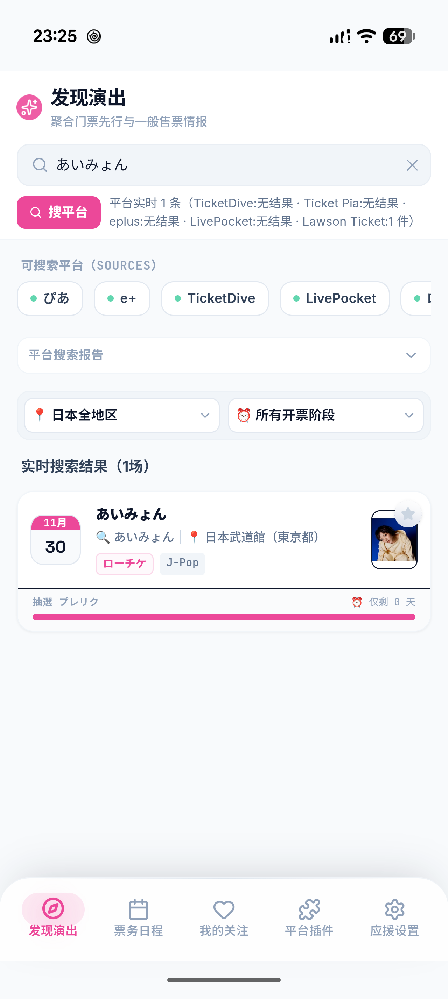
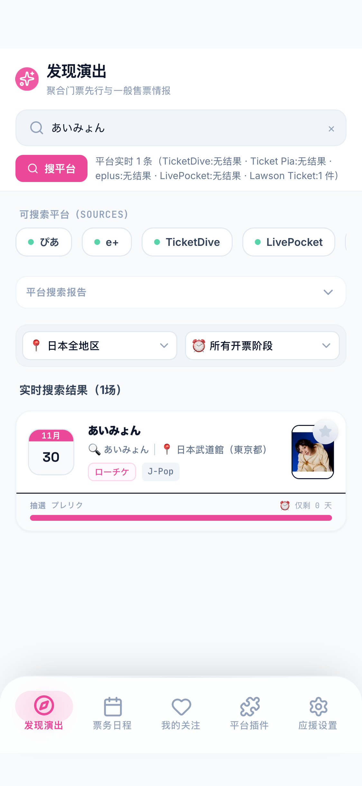
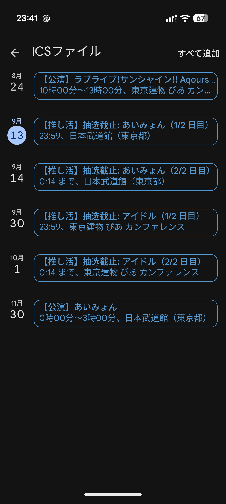

# 双实机 Live 数据与代码审查报告

后续状态：下述五项问题已于 2026-09-14 修复，见 [修复记录及回归结果](FIXES.md)。本文保留修复前的实机观察，便于对照。

测试日期：2026-09-13（日本时间）。审查版本：`87fa7ac`，应用版本 1.1.2。

**结论：五个票务源都能在 Pixel 和 iPhone 上请求到真实数据，并渲染搜索卡片；但“能抓到”不等于“场次和时间准确”。本轮确认 5 项需要修复的问题，其中 4 项直接影响场次完整性或票务时间，不建议仅凭现有自动化测试通过就判定可发布。**

本轮只审查、测试并保存证据，未修改产品代码，未创建新 Release。两台手机上的临时 QA 应用、测试通知与测试连接已清理。复现数据见 [evidence.json](evidence.json)。

## 测试方式与边界

- Pixel（设备代号 grizzly），Android 17；iPhone 13 mini，iOS 26.4.1。两台均为无线连接的真实设备。
- 从上述提交建立独立 `推し活 QA` 应用，包名为 `com.aoki.oshikatsumgr.qa`。测试原生构建使用正式版前端构建配置，加入临时测试控制入口；不是逐字节相同的发布 APK/IPA。
- 搜索使用应用真实解析器和原生网络插件。Android Lawson 使用 Cronet，iOS 使用 URLSession/CapacitorHttp；本轮 Live 验证没有用模拟接口替代平台响应。
- 测试控制器操作实际 React 页面并读取原生返回值；截图来自真实设备。异常网络场景单独使用故障注入，不能等同于真实断网测试。
- 收藏、关注、日历等操作只使用测试应用内的数据；没有修改原应用的数据，也没有向用户日历正式添加测试日程。
- 仅覆盖本轮关键词及返回的第一页结果。未覆盖所有艺人、所有票种、分页全量、登录后内容、支付购票、长期后台/省电模式下提醒、完整代理服务的实时抓取，以及原安装版本到本版本的升级迁移。

## 实时搜索与显示结果

表中的“返回”是来源报告的条目数，“卡片”是应用最终渲染数量，二者之间还经过去重和聚合。

| 来源 | 关键词 | Pixel 返回 / 卡片 | iPhone 返回 / 卡片 | 结果 |
| --- | --- | ---: | ---: | --- |
| eplus | アイドル | 20 / 12 | 20 / 12 | 请求、解析、显示成功；发现编号冲突与误合并 |
| Ticket Pia | FRUITS ZIPPER | 3 / 3 | 2 / 2 | 请求、解析、显示成功；详情遇到官网繁忙页时静默缺字段 |
| LivePocket | 闇雲 | 20 / 15 | 20 / 15 | 请求、解析、显示成功；多场演出被误合并 |
| TicketDive | HEROINES | 10 / 10 | 10 / 10 | 请求、解析、显示及详情补齐成功 |
| Lawson Ticket | あいみょん | 1 / 1 | 1 / 1 | 两种原生网络路径均成功；跨日场次只保留首日 |

这些是测试时刻的快照，不是平台全部演出数量。Pia 的两端返回数量存在差异，未证明差异由设备解析造成，不能把两端不同数量直接判为 iOS 故障。

另外，eplus 搜索「あいみょん」「FRUITS ZIPPER」时返回空数组。读取官网嵌入 JSON 后确认 `so_kensu: 0`、`record_list: []`，本轮属于官网真实无命中，不是解析异常。

详情验证：Pia 的正常响应能补齐申请开始和结果公布时间；LivePocket 的真实详情可以从 1 个占位窗口扩展为 2 个受付窗口；TicketDive 的真实详情能补齐受付起止时间；eplus、Lawson 的搜索结果已带受付窗口。

## 需要修复的问题

### 1. P1：聚合把同日同馆的不同演出合成一场

位置：`src/sources/aggregate.ts:148`；相关身份键：`src/favorites.ts:15`。

真实 LivePocket 数据复现：

- 2026-09-23，池袋 SOUND PEACE：`lp-rggm4`「みすず生誕祭」12:50，与 `lp-cw4vm`「阿修羅chan vol.3」16:50，最后合成一张 12:50 的卡。
- 2026-09-06，RADHALL：`lp-x3n-y` 16:00 与 `lp-itqaq` 18:20 同样被合并。

聚合先按搜索词/艺人和日期分组，随后只判断会场兼容性，没有排除不同开演时间、不同平台公演编号；同平台的两场也会合并。标题可能取另一场的较长标题，而时间取第一场，造成标题、开演时间与受付窗口混搭。

建议：以平台场次身份为基础；已知开演时间不同必须分开，同平台不同公演保守处理。同步调整聚合 ID 和收藏别名，否则单独修改分组后，收藏仍可能串场。回归用例应覆盖同日昼夜场、同馆不同活动、时间未知时的跨平台匹配和旧收藏迁移。

### 2. P1：eplus 两场演出在解析阶段生成同一个 ID

位置：`src/sources/eplus.ts:77`。

官网真实记录：

| 公演 | 日期 / 时间 | kogyo_code | kogyo_sub_code | koen_code |
| --- | --- | --- | --- | --- |
| MARQUEE祭 mini Vol.344 | 2026-09-12 11:00 | 202963 | 0558 | 001 |
| MARQUEE祭 mini Vol.345 | 2026-09-12 17:00 | 202963 | 0559 | 001 |

两条在同一 Spotify O-nest 会场，详情链接的 `P0030558` / `P0030559` 不同；当前均得到 `eplus-202963-20260912-1500320`。后续按 ID 去重后只留下 17:00 的一条。这个问题发生在聚合之前，仅修复问题 1 无法恢复被去重吞掉的演出。

建议：ID 纳入官网完整公演身份，例如 `kogyo_code + kogyo_sub_code + koen_code`，必要时带日期/时间消歧；受付窗口 ID 一起保持唯一。不要仅补 `koen_code`，本次两条的该字段也相同。

### 3. P1：批量日历导出把真实截止时间改成 23:59

位置：`src/utils.ts:261`；单项日期式导出也存在同类硬编码。

Pixel 实际点击“导出全部到手机日历”，原生文件写入与 FileOpener 成功，并进入 Google 日历导入预览。读取生成文件确认：

- eplus 活动 `eplus-459028-20260824～20260930-041`，真实受付结束为 `2026-09-30T18:00:00+09:00`。
- 导出却写成 `DTSTART;TZID=Asia/Tokyo:20260930T235900`，晚 5 小时 59 分钟。
- 批量导出只读取简化的 timeline 日期，未逐个保留多轮窗口、结果公布和入金截止等精确节点。

建议：以 `ticketWindows` 的精确时间构建相应日程；只有旧数据确实缺少时间时才采用明确标注的兜底。用真实 18:00 截止、多轮窗口、跨午夜、一般发售及入金场景验证生成内容与导入预览。

### 4. P1：Lawson 的两日公演只保留第一天

位置：`src/sources/lawsonParser.ts:210`、`:239`。

两台手机抓到「あいみょん / 日本武道館」时，记录 ID 为 `lawson-70896-20261130,20261201`，包含两个公演日期。但最终只有 `date: 2026-11-30`，应用没有 12 月 1 日的独立场次；日历也只导出了 11 月 30 日。

解析器从“公演日”文本取第一个匹配日期，每个 information 块只输出一个事件。此外，未知开演时间固定写成 `00:00`，本轮 Google 日历预览将其显示为午夜 0:00–3:00 的演出。

建议：保留日期列表并展开明确的多个公演日，或明确表示“多日/日期范围”而非单场。对未提供的开演时间保留未知值；日历使用全天/待定表达，提醒不能默认宣称午夜开演。

### 5. P2：Pia 返回 HTTP 200 的繁忙页时，详情缺失没有提示

位置：`src/sources/pia.ts:202`–`:207`；界面使用处：`src/components/EventDetailModal.tsx` 的详情补齐逻辑。

同一个 KAWAII LAB. SESSION 受付页，正常响应含 9 月 4 日 18:00 开始、9 月 13 日 23:59 截止及 9 月 17 日 18:00 结果公布。iPhone 的实际详情请求曾收到 200 状态、`text/html; charset=None` 的官网繁忙提示页，正文为「アクセスが集中しております」。

程序直接解析该页，得到全空日期，随后原样返回旧事件；界面没有告知本次详情未获取成功，结果公布提醒也因此缺失。直接读取同一正常页面时两端均能获得 UTF-8 内容，现有证据不支持“iOS 日期解析或编码坏了”的判断。

建议：识别这类明确的官网繁忙页，并让详情补齐返回可展示的状态；保留已有资料但提示信息不完整，允许用户稍后重试或打开官网。不要把这种状态显示为正常获取完成，也不要连续重试官网明确要求稍后再试的页面。Pia 二级搜索请求同样应检查响应状态和异常内容。

## 其他功能验证

| 项目 | Pixel | iPhone | 说明 |
| --- | --- | --- | --- |
| 真实搜索结果、详情打开/关闭、受付时间线 | 通过 | 通过 | 数据准确性问题见上文 |
| 收藏写入与冷启动恢复 | 通过 | 通过 | 使用测试应用自己的持久化写路径 |
| 艺人、场馆关注及关注列表 | 通过 | 通过 | 从真实搜索事件的详情操作 |
| 五个来源逐一禁用、启用 | 通过 | 通过 | 单源实搜报告也仅出现启用的来源 |
| 中文/日文切换、应援色 | 通过 | 通过 | 冷启动后配置保留 |
| 系统通知权限、UI 添加、UI 取消 | 通过 | 通过 | 原生 pending 队列与应用提醒记录核对一致 |
| 短时通知实际送达 | 通过 | 通过 | 15 秒测试排程，系统 delivered 列表确认；已清除 |
| 网络失败后的错误提示、退出等待、保留收藏 | 通过 | 通过 | 对 TicketDive 原生调用注入网络失败；不是实际断网 |
| 日历追踪、截止雷达 | 通过 | 通过 | 页面可用，个别文案/时间问题见下方 |
| .ics 生成及 Google 日历导入预览 | 通过，有数据错误 | 按设计不提供 | iOS 裁剪见 `docs/adr/0004-ios-scope-trim.md`；未按下正式导入 |
| 重置清除收藏/关注/缓存/应援色及 pending 通知 | 通过 | 通过 | 先排入未来测试通知，再执行测试应用的重置操作 |

本轮另见一些较低优先级的显示问题：设置页仍写 v1.0；详情页的不足一天截止显示“还有 1 天”，与发现页“0 天”不一致；Lawson 未知时间显示 `00:00`；持续多日的 eplus 展览被压成起始日的一次演出。建议和准确性修复一起纳入后续回归。

## 自动化与构建

- 单元/组件测试：28 个测试文件，339 项通过。
- Playwright：6 条浏览器流程通过。这些使用固定响应，不代表实时平台覆盖。
- TypeScript 检查通过；版本一致性检查通过：1.1.2 / native build 4。
- 生产依赖审计：0 项已知漏洞（本轮运行结果）。
- Android QA 安装包构建、安装、启动通过；iPhone QA 真机签名构建、无线安装、启动通过。

现有测试未覆盖本报告中的真实多场身份冲突、HTTP 200 繁忙页和精确截止时间导出，测试全绿不能排除这些问题。建议先按 1–4 修复场次与时间，再补 5 的详情错误反馈，并使用这里的去标识化快照建立回归用例后重新实机验收。

## 截图

Android / iPhone 的 Lawson 真实搜索：

Google 日历真实导入预览，可见 23:59 截止和未知开演时间被写成午夜：

